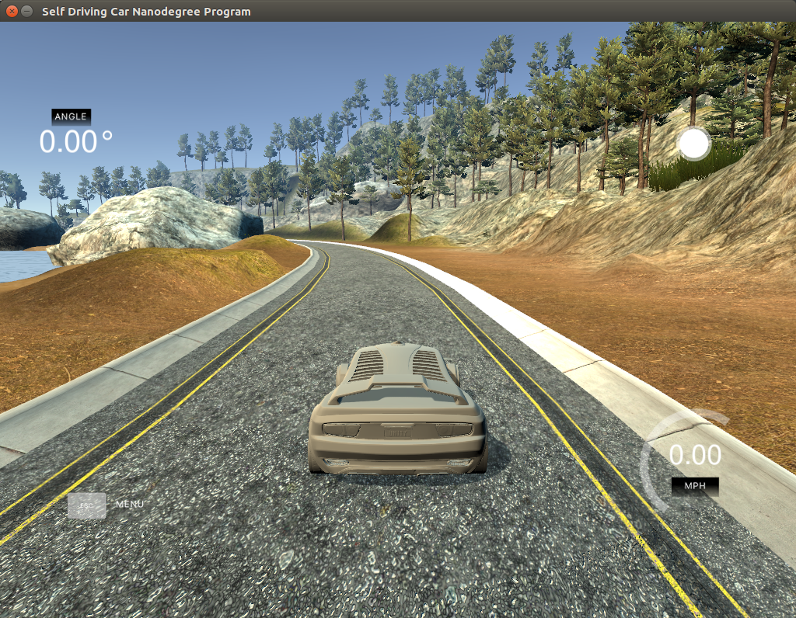
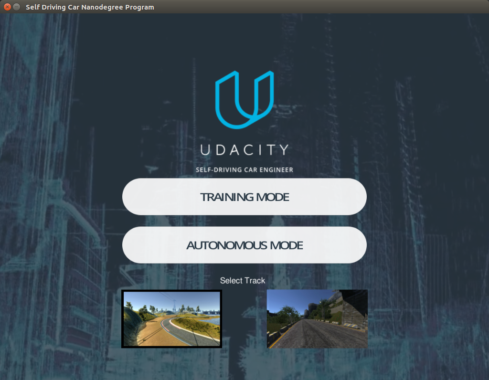
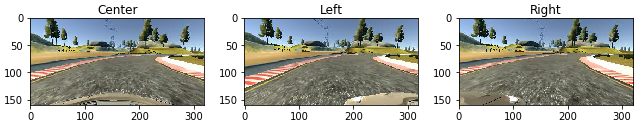
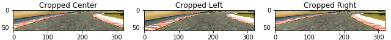
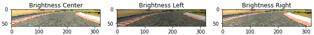
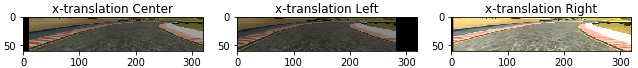
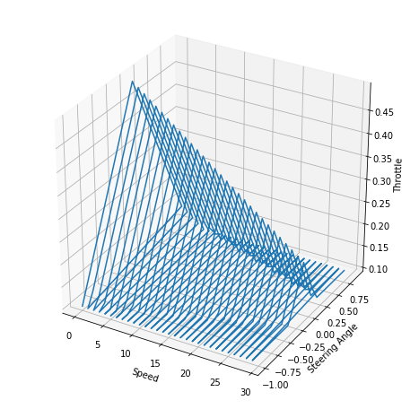

# CarND-Behavioral-Cloning

Simply put the goal of this project is to teach a car how to drive itself in a simulator.



The idea of behavioral cloning is to learn by imitation. In this project we train a Neural Network
with images from cameras in a car and their associated recorded steering angles. Once the network is trained it can be 
used to predict steering angles based on new images received from the simulator and use it to guide the car.

The car should be able to drive the track without any mistakes. More specifically, from the Udacity Self-Driving Car 
Nanodegree project specification: "No tire may leave the drivable portion of the track surface. The car may not pop up 
onto ledges or roll over any surfaces that would otherwise be considered unsafe (if humans were in the vehicle)."

The solution implemented in this project involves the following steps:
* Collect training data.
* Pre-process images and augment the training set.
* Create a Neural Network Architecture that can learn the steering angle.
* Configure the Neural Network training parameters and train the network.
* Use the neural network to drive the car in the simulator.

The next sections describe each of the steps above, followed by a conclusion.

## Training Data
The training data is composed of:
* Center camera image
* Left camera image
* Right camera image
* Steering angle
* Throttle
* Brake
* Speed

Training data can be recorded using Udacity's  simulator in Training Mode: 



The simulator writes a csv file containing the training data parameters and  the images captured from the cameras in
the car:
```
center, left, right, steering, throttle, brake, speed
IMG/center_2016_12_01_13_32_43_357.jpg, IMG/left_2016_12_01_13_32_43_357.jpg, IMG/right_2016_12_01_13_32_43_357.jpg, 0, 0.735778, 0, 0.9536688
IMG/center_2016_12_01_13_32_43_457.jpg, IMG/left_2016_12_01_13_32_43_457.jpg, IMG/right_2016_12_01_13_32_43_457.jpg, 0.0617599, 0.9855326, 0, 2.124567
...
```

Udacity Self-Driving Car team released a dataset with 8036 data samples as an optional starting point for the project.
I recorded an additional 5629 samples using the simulator and a Logitech G920 steering wheel. The additional images
include regular laps on the first track and also "recovery" recordings showing how to go back to the center of the track
 from the borders of the track. A total of 13665 samples was used for training and validation.

## Image Pre-Processing
As mentioned in the previous section each training sample contains images from center, left and right cameras:



The first step in the image processing pipeline is to crop the images, removing parts of the image that are not relevant
for training, such as the horizon region. I kept the rows 60:120 in the y-axis to use only the road as part
of the training image:



Next in the pipeline I randomly adjusted the brightness to account for  situations such as day and night:



In the next step of the pipeline I randomly translated the image horizontally up to 40 pixels to the left or right,
adjusting the steering angle based on the translation factor:



The next step in the pipeline consists of randomly flipping the image over the y-axis, multiplying the steering
 by -1.
 
Finally the image is converted from BGR space to YUV and each pixel is normalized between (-0.5, 0.5). 
The processed image and the new steering angle are returned as a result of the pre-processing step.

The methods described in this section are implemented in frame_processing.py, with entry point method preprocess_image.

## Neural Network Architecture: NVIDIA-based model
The Neural Network implemented in this project is heavily based on the NVIDIA model described in the paper:
 
[_Mariusz Bojarski et al., End to End Learning for Self-Driving Cars_](https://images.nvidia.com/content/tegra/automotive/images/2016/solutions/pdf/end-to-end-dl-using-px.pdf) 

The NVIDIA network consists of 5 convolutional layers, followed by 5 fully connected layers. I added dropout layers
 between 3 of the fully connected layers and adjusted the neural network input to receive images with size (60,320,3)
 instead of (66,200,3) from NVIDIA.

The neural network was implemented using the Keras API on top of TensorFlow.
```
Layer (type)                     Output Shape          Param #     Connected to                     
====================================================================================================
convolution2d_1 (Convolution2D)  (None, 30, 160, 24)   1824        convolution2d_input_1[0][0]      
____________________________________________________________________________________________________
convolution2d_2 (Convolution2D)  (None, 15, 80, 36)    21636       convolution2d_1[0][0]            
____________________________________________________________________________________________________
convolution2d_3 (Convolution2D)  (None, 8, 40, 48)     43248       convolution2d_2[0][0]            
____________________________________________________________________________________________________
convolution2d_4 (Convolution2D)  (None, 8, 40, 64)     27712       convolution2d_3[0][0]            
____________________________________________________________________________________________________
convolution2d_5 (Convolution2D)  (None, 8, 40, 64)     36928       convolution2d_4[0][0]            
____________________________________________________________________________________________________
flatten_1 (Flatten)              (None, 20480)         0           convolution2d_5[0][0]            
____________________________________________________________________________________________________
dense_1 (Dense)                  (None, 1164)          23839884    flatten_1[0][0]                  
____________________________________________________________________________________________________
dropout_1 (Dropout)              (None, 1164)          0           dense_1[0][0]                    
____________________________________________________________________________________________________
dense_2 (Dense)                  (None, 100)           116500      dropout_1[0][0]                  
____________________________________________________________________________________________________
dropout_2 (Dropout)              (None, 100)           0           dense_2[0][0]                    
____________________________________________________________________________________________________
dense_3 (Dense)                  (None, 50)            5050        dropout_2[0][0]                  
____________________________________________________________________________________________________
dropout_3 (Dropout)              (None, 50)            0           dense_3[0][0]                    
____________________________________________________________________________________________________
dense_4 (Dense)                  (None, 10)            510         dropout_3[0][0]                  
____________________________________________________________________________________________________
dense_5 (Dense)                  (None, 1)             11          dense_4[0][0]                    
====================================================================================================
Total params: 24,093,303
Trainable params: 24,093,303
Non-trainable params: 0
```
## Neural Network Training Parameters
The neural network described above was trained using the following parameters:
* Number of epochs: 40
* Batch size: 64
* Optimizer: Adam, learning rate: 1e-4 showed better convergence results than the default 1e-3.
* Validation split: 20% of the dataset.
* Early Stopping: I used early stopping to stop training when val_loss does not improve after
3 epochs (patience=3).
* Generator: I used a data generator for Keras. The purpose is to avoid having all the image data in memory at any
 point in time, since for large datasets it could consume all system memory resources. 

Once the network is trained the model is saved to disk (model.json and model.h5) so that drive.py can load it and 
use it for predicting steering angles. 

## Using the Neural Network to Drive the Car
The python code that predicts the steering angles and drive the car is implemented in drive.py. The template for this
file was provided by Udacity. It loads the trained neural network model from disk and uses the images provided by the 
simulator (which is connected to drive.py using a socket) to predict the steering angle. The implementation in drive.py 
also has to provide a throttle for the simulator, otherwise the car would not move. I used a simple expression for 
throttle as a function of the predicted steering angle and current speed.



A variable throttle turned out to be important mostly in the second track, as it has several hills, valleys and sharp 
curves. 

The image is also cropped, converted from RGB to YUV and normalized in drive.py before predicting the steering angle. 

## Conclusion
This project shows how to use a deep learning neural network to teach a car how to drive itself. After training the 
network using data from one track it was able to generalize it and use the network to drive an unseen track, completing 
both tracks without any mistakes.

The video results from this project can be viewed in the following links:

### Track 1
[](http://www.youtube.com/watch?v=_OV4fGL45To)

### Track 2
[](http://www.youtube.com/watch?v=YAKpJJdbG4c)

